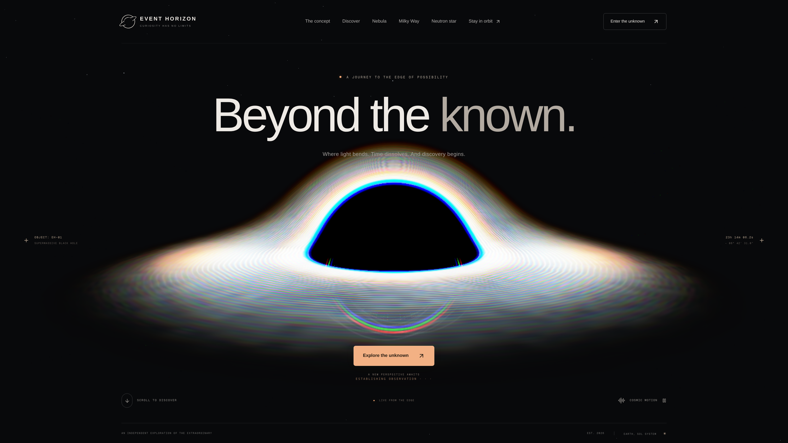
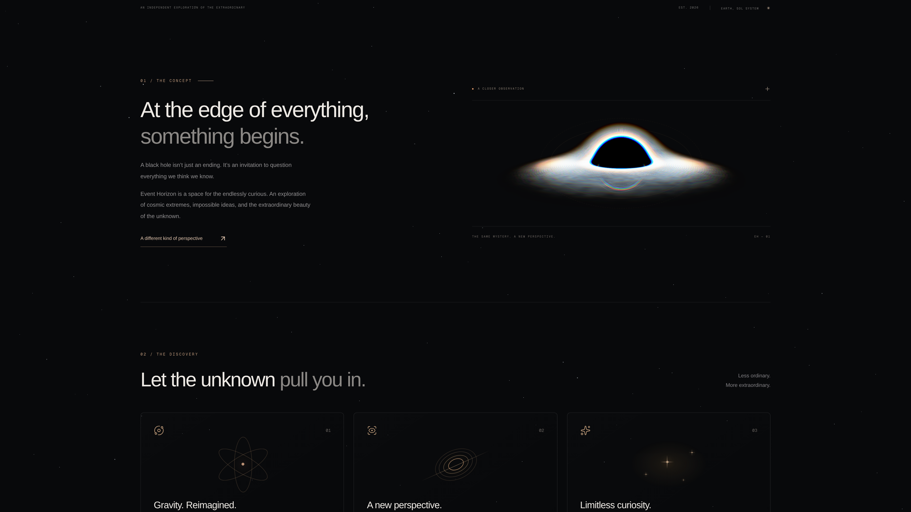
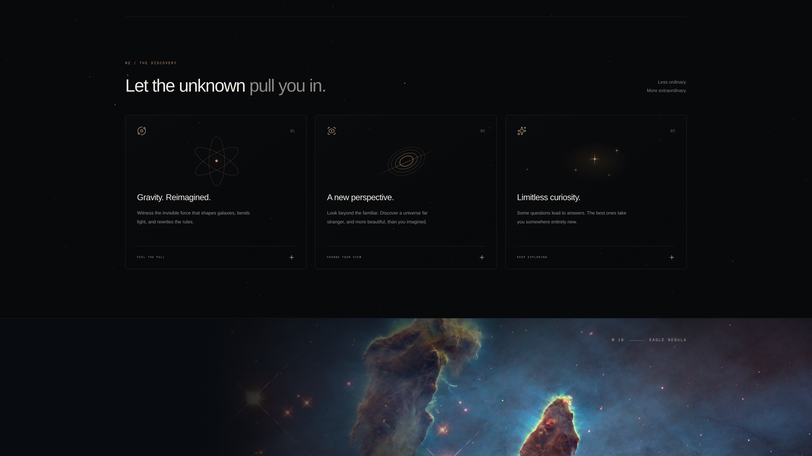
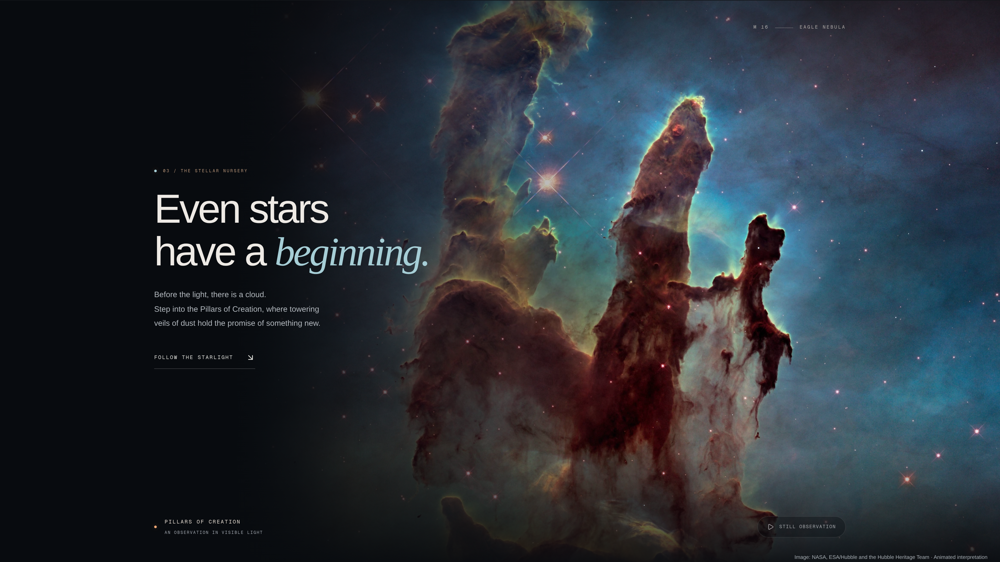
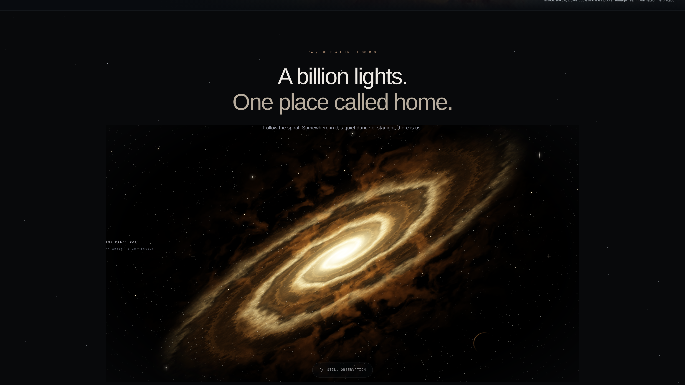
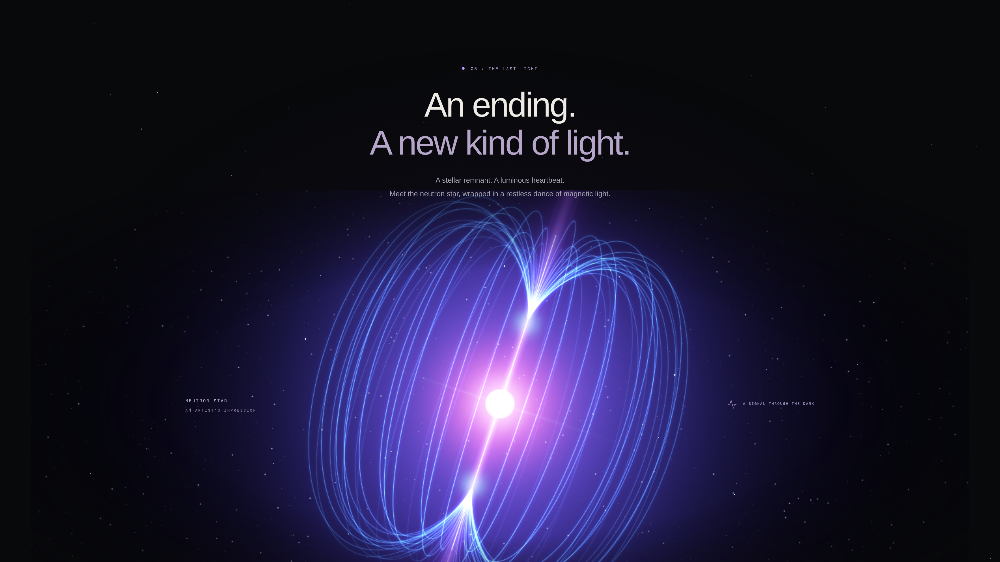
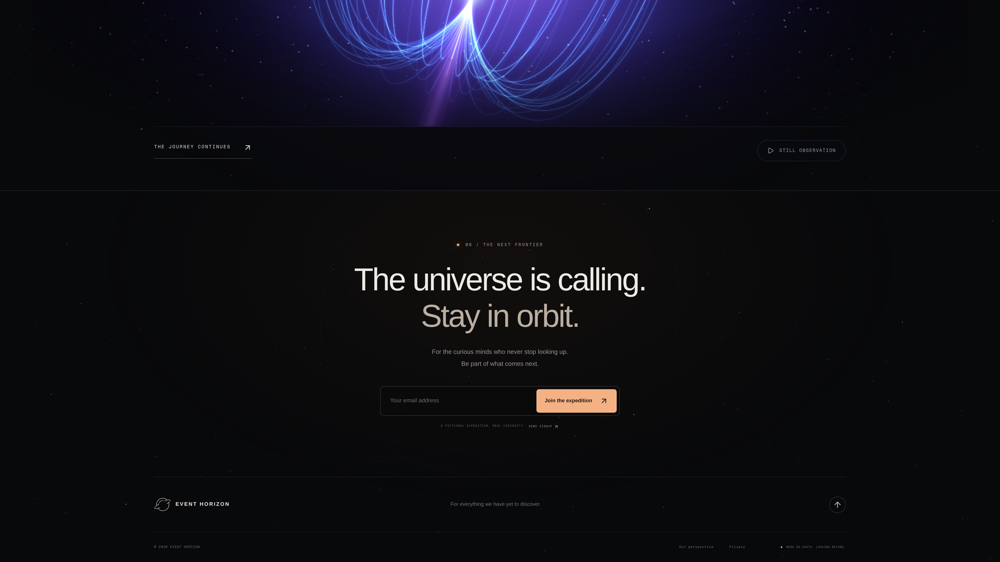

# Event Horizon

An immersive, cinematic journey through cosmic extremes—from a gravitationally lensed black hole to the Pillars of Creation, the Milky Way, and the magnetic field of a neutron star.

[](https://nextjs.org/)
[](https://react.dev/)
[](https://www.typescriptlang.org/)
[](https://threejs.org/)

**[View the live experience](https://demo-astra-sigma.vercel.app)**



## About

Event Horizon is a responsive, single-page web experience that turns astronomy into an interactive visual narrative. It combines realtime WebGL scenes, custom GLSL shaders, motion-led storytelling, and editorial typography to explore the beauty and mystery of deep space.

The journey is organized as six chapters:

1. **The observation** — an interactive supermassive black hole with gravitational lensing and a white-hot accretion disk.
2. **The concept** — a closer look at the idea behind Event Horizon.
3. **The discovery** — expandable cards explaining gravity, lensing, and scientific curiosity.
4. **The stellar nursery** — an atmospheric presentation of the Pillars of Creation.
5. **Our place in the cosmos** — a rotating artistic interpretation of the Milky Way.
6. **The last light** — a neutron star surrounded by magnetic ribbons and polar beams, followed by a local-only expedition signup.

## Experience

### The concept

The black hole travels from the opening hero into a smaller observation frame as the page scrolls, keeping the visual story continuous.



### The discovery

Three interactive cards reveal short explanations of gravity, gravitational lensing, and unanswered questions in modern physics.



### The stellar nursery

The Pillars of Creation become a full-width deep-space observation with layered dust, stars, gentle motion, and visible image credit.



### The Milky Way

A procedural spiral galaxy uses differential rotation, dust lanes, stars, and a warm luminous core to create a sense of galactic scale.



### The neutron star

The final observation combines a pulsing white-pink core, violet polar beams, and cyan magnetic-field ribbons generated from 3D curves.



### The next frontier

The closing transmission includes a privacy-conscious demo signup. The submitted email is never stored or sent; only a local joined/not-joined preference is retained.



> All screenshots above are committed as 3840 × 2160 PNG files in `public/screenshots`.

## Highlights

- Custom GLSL black-hole ray bending, accretion-disk shading, bloom, and spectral edge separation.
- React Three Fiber scenes for the black hole, spiral galaxy, nebula atmosphere, and neutron star.
- A scroll-linked black hole that moves between the hero and concept observation.
- Lazy scene initialization with `IntersectionObserver` and offscreen animation pausing.
- Independent motion controls for each major observation.
- Responsive rendering that reduces geometry and effects on smaller devices.
- Reduced-motion support, semantic labels, keyboard navigation, a skip link, and visible focus states.
- Static poster fallbacks when WebGL is unavailable or its context is lost.
- Smooth scrolling with Lenis and reveal transitions with Framer Motion.
- A local-only signup demonstration with no backend, tracking, or email transmission.

## Implementation

The page uses the Next.js App Router. `app/page.tsx` composes the experience from focused section components, while the expensive 3D scenes are client-only and loaded only when needed.

| Area | Implementation |
| --- | --- |
| Page shell | `app/page.tsx`, `app/layout.tsx`, and `app/globals.css` |
| Black-hole journey | `components/CosmicExperience.tsx`, `SceneLoader.tsx`, and `BlackHoleScene.tsx` |
| Black-hole shader | `components/scene/shaders.ts` and `SpectralOptics.tsx` |
| Deep-space scenes | `components/DeepSpaceVisual.tsx` and `components/scene/DeepSpaceScene.tsx` |
| Galaxy and nebula shading | `components/scene/deep-space-shaders.ts` |
| Neutron-star field | `components/scene/NeutronStarField.tsx`, `neutron-star-shaders.ts`, and `magnetic-field-geometry.ts` |
| Motion and reveals | `components/SmoothScroll.tsx`, `Reveal.tsx`, and `useMotionPreference.ts` |
| Browser checks | `scripts/verify.mjs` |

The black-hole shader traces curved light paths through a simplified gravitational field. Its disk uses differential rotation and layered temperature, distortion, and spectral effects. The galaxy and neutron-star scenes use separate shader and geometry modules so they can be loaded, paused, and tuned independently.

## Tech stack

- Next.js 16 and React 19
- TypeScript
- Three.js, React Three Fiber, and Drei
- GLSL shaders
- Framer Motion
- Lenis smooth scrolling
- Tailwind CSS 4 with project-specific global styling
- Lucide icons
- Playwright for browser verification

## Getting started

Requirements: Node.js 20+ and pnpm.

```bash
pnpm install
pnpm dev
```

Open [http://localhost:3000](http://localhost:3000).

### Production build

```bash
pnpm build
pnpm start
```

### Code quality

```bash
pnpm lint
node scripts/verify.mjs
```

The verification script expects the app to be running at `http://localhost:3000` unless `BASE_URL` is provided. Set `BROWSER_PATH` if Brave is not installed at the script's default location.

## Project structure

```text
app/                    Next.js layout, page composition, and global styles
components/             Interface sections and reusable client behavior
components/scene/       Three.js scenes, shaders, optics, and geometry
public/                 Posters, source imagery, icons, and README screenshots
scripts/verify.mjs      Playwright interaction and fallback checks
```

## Image credit

The nebula section uses the original [Pillars of Creation photograph](https://esahubble.org/images/heic1501a/) by NASA, ESA/Hubble, and the Hubble Heritage Team, licensed under [CC BY 4.0](https://creativecommons.org/licenses/by/4.0/). Atmospheric motion and presentation layers were added for this project.

## Suggested GitHub details

**Description**

> An immersive cinematic space experience built with Next.js, React Three Fiber, Three.js, and GLSL—featuring a black hole, the Pillars of Creation, the Milky Way, and a neutron star.

**Topics**

`nextjs` · `react` · `typescript` · `threejs` · `react-three-fiber` · `webgl` · `glsl` · `creative-coding` · `interactive-website` · `space` · `astronomy` · `black-hole` · `generative-art` · `framer-motion` · `lenis` · `tailwindcss`
